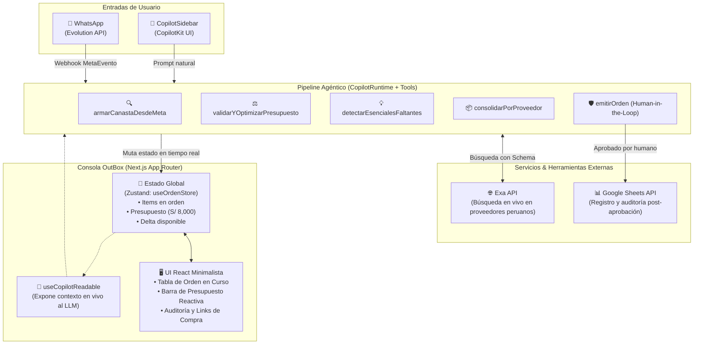

# 📦 OUTBOX — Definición de Proyecto & Guion Audiovisual (2 Minutos)

> **Hackathon:** "Agents, Everywhere" (AI Tinkerers · Lima)  
> **Tema Central:** *"Los agentes salen del chatbox. Construye un agente para un lugar donde la gente ya trabaja, y hazlo más útil gracias a ESE contexto."*  
> **Duración del Video:** 2 minutos exactos (120 segundos)  
> **Ritmo de Locución:** ~140 palabras por minuto (~270 - 285 palabras totales habladas)

---

## 1. Definición Integral del Proyecto

### 1.1 Visión & Propuesta de Valor
**OutBox** es un copiloto agéntico de compras por lote y aprovisionamiento B2B incrustado directamente en la consola operativa de compras de una empresa.

En lugar de obligar al encargado de compras a cambiar de contexto, cotizar manualmente en decenas de pestañas de proveedores, calcular proporciones de insumos en Excel y vigilar presupuestos a mano, **OutBox le permite describir un evento o necesidad en una sola frase** (desde la propia interfaz o vía WhatsApp). El agente analiza el estado visible en pantalla, busca productos reales en la web en vivo con precios peruanos, optimiza el presupuesto, detecta omisiones críticas y somete la orden final a aprobación humana con un solo clic.

---

### 1.2 El Problema vs. La Solución

| Dimensión | Flujo Tradicional B2B | Con OutBox (Copiloto Agéntico) |
| :--- | :--- | :--- |
| **Punto de Partida** | Formulario rígido o correo con requerimientos vagos. | Frase en lenguaje natural: *"Activación para 150 personas, presupuesto S/ 8,000, entrega viernes"*. |
| **Catálogo & Precios** | Búsqueda manual en 10 páginas distintas o catálogos desactualizados. | **Búsqueda en vivo vía Exa API**: proveedores peruanos reales, precios vigentes en Soles y links directos. |
| **Control de Presupuesto** | Cuadre manual en hojas de cálculo; si se pasa, recortar a ciegas. | **Optimización reactiva**: re-busca alternativas más económicas o calibra cantidades manteniendo la meta. |
| **Prevención de Olvidos** | Omisiones detectadas el día del evento (falta de vasos, bolsas, etc.). | **Detección proactiva de esenciales**: sugiere insumos críticos antes de emitir la compra. |
| **Consolidación** | Envíos dispersos con múltiples fletes y fechas dispares. | **Agrupación por proveedor** para reducir costos logísticos. |
| **Gobernanza** | Riesgo de compras automáticas sin supervisión. | **Human-in-the-Loop estricto**: confirmación con UI generativa antes de emitir la orden. |

---

### 1.3 Arquitectura Técnica



---

### 1.4 Stack Tecnológico & Roles

1. **Frontend & Framework:** `Next.js` (App Router) + `TypeScript` + `Tailwind CSS`. UI limpia, modo oscuro, sin ruido visual.
2. **Copiloto & Agente Integrado:** `CopilotKit` (`@copilotkit/react-core`, `@copilotkit/react-ui`, `CopilotRuntime`).
   - `useCopilotReadable`: Otorga visión periférica al agente sobre la orden actual y el presupuesto.
   - `useCopilotAction` + `renderAndWaitForResponse`: Ejecuta transformaciones de estado y bloquea la emisión hasta recibir aprobación humana interactiva.
3. **Grounding Web en Vivo:** `Exa API` (`exa-js`). Busca insumos con precios reales en Soles (S/) y proveedores verificables de Lima/Perú.
4. **Gestión de Estado:** `Zustand` (`useOrdenStore`). Gestión atómica y reactiva de la canasta, presupuesto y cálculos de delta.
5. **Entrada Omnicanal:** `Evolution API` (Docker / WhatsApp Web Baileys) para disparar requerimientos desde el celular del jefe de compras.
6. **Auditoría & Post-Procesamiento:** `Google Sheets API` para registro de órdenes y métricas agénticas.

---

## 2. Guion Audiovisual Estructurado (2 Minutos / 120 Segundos)

> **Configuración de Grabación recomendada:**  
> - Resolución: 1920x1080 a 60 fps.  
> - Lado izquierdo: Consola OutBox en `http://localhost:3000`.  
> - Lado derecho: Barra lateral de CopilotKit abierta o ventana flotante de WhatsApp.  
> - Micrófono claro, tono dinámico, seguro y con ritmo constante.

```
TIEMPO TOTAL: 02:00 (120 Segundos)
PALABRAS ESTIMADAS: 275 palabras (~138 palabras/minuto)
```

### Tabla de Producción Segundo a Segundo

| Tiempo | Bloque / Fase | Escena Visual (Pantalla) | Locución (Voz en Off / Presentador) | Acción en Vivo / SFX |
| :---: | :---: | :--- | :--- | :--- |
| **0:00 - 0:15**<br>*(15s)* | **El Problema** | • B-roll rápido de compras desordenadas o pantalla dividida con 12 pestañas de cotizaciones y un Excel abarrotado.<br>• Corte a la consola vacía de **OutBox** con presupuesto fijado en S/ 8,000. | *"Equipar un evento corporativo o una activación de marca suele tomar horas: cotizar proveedor por proveedor, calcular insumos a ciegas en un Excel y rezar para no pasarse del presupuesto ni olvidar lo esencial."* | Zoom sutil a la interfaz limpia de OutBox.<br>*SFX: Tictac o tecleo rápido que se apaga al mostrar OutBox.* |
| **0:15 - 0:35**<br>*(20s)* | **La Tesis & El Disparador** | • El presentador muestra un mensaje en WhatsApp o escribe en el sidebar de CopilotKit:<br>`"Equipar una activación para 150 personas, presupuesto S/ 8,000, entrega el viernes"`<br>• El agente reconoce la meta al instante. | *"Para el hackathon 'Agents, Everywhere', sacamos a la IA del chatbox tradicional. Esto es OutBox: un copiloto agéntico incrustado en tu consola de compras que razona sobre lo que ves en pantalla. Una sola frase... y el agente toma el control."* | Enviar el mensaje por WhatsApp o presionar Enter en el sidebar.<br>*SFX: Notificación suave de confirmación.* |
| **0:35 - 1:05**<br>*(30s)* | **El Núcleo Agéntico (Exa en Vivo)** | • En la consola, los ítems comienzan a poblarse automáticamente línea por línea.<br>• Se aprecian productos peruanos reales, precios en Soles, proveedores (Alquileres Lima, Eco Yura) y sus links directos.<br>• La barra de presupuesto avanza progresivamente. | *"Aquí no hay un catálogo simulado. Mediante Exa API, el agente busca en vivo en la web peruana: cotiza sillas, mesas e insumos descartables con precios reales y enlaces verificables. Estima cantidades para 150 personas y calibra la canasta en tiempo real frente a tus ojos."* | Scroll fluido por la lista de ítems conforme entran a la orden.<br>Cursor resalta el link de origen y el proveedor. |
| **1:05 - 1:25**<br>*(20s)* | **El Momento Wow: Presupuesto & Prevención** | • El presupuesto se colorea en ámbar o rojo ligero (exceso de S/ 450).<br>• El agente ejecuta `validarYOptimizarPresupuesto` y `detectarEsencialesFaltantes`.<br>• En el chat aparece: *"Ajusté cantidades y detecté que faltaban vasos descartables y bolsas para 150 personas."* La orden se actualiza. | *"Pero el agente no solo llena un carrito: cuida tu dinero. Si la canasta excede el techo, busca alternativas más económicas. Y mejor aún: detecta omisiones críticas. Sabe que para 150 personas olvidaste vasos y bolsas, y los incorpora antes de que sea tarde."* | La barra de presupuesto vuelve a verde (`S/ 7,420 consumidos / S/ 580 disponibles`).<br>Aparecen los dos ítems salvadores en la tabla. |
| **1:25 - 1:45**<br>*(20s)* | **Human-in-the-Loop & Generative UI** | • Aparece la tarjeta interactiva de CopilotKit:<br>**"Voy a emitir esta orden: 5 ítems, 2 proveedores, total S/ 7,420. ¿Aprobar?"**<br>• Botones interactivos `[Aprobar]` y `[Editar]`.<br>• El usuario da clic en `[Aprobar]`.<br>• Se genera la tarjeta de confirmación y se envía a Google Sheets. | *"Gobernanza total: el agente jamás compra a tus espaldas. A través de la UI generativa de CopilotKit, consolida los proveedores y solicita confirmación humana interactiva. Un clic en 'Aprobar'... y la orden queda formalizada y auditada en Google Sheets."* | Clic directo en el botón `[Aprobar]`.<br>Animación de éxito con check verde.<br>Pestaña rápida mostrando la fila creada en Google Sheets. |
| **1:45 - 2:00**<br>*(15s)* | **Cierre & Impacto** | • Plano general de la pantalla con la orden completada.<br>• Overlay limpio con el logotipo de **OutBox** y tecnologías: *Next.js · CopilotKit · Exa · Zustand*.<br>• Frase final contundente. | *"De pasar cuatro horas batallando entre cotizaciones y hojas de cálculo, a describir una necesidad y aprobar la orden perfecta en segundos. Eso es OutBox: agentes donde el trabajo realmente ocurre. Muchas gracias."* | Fade out elegante a negro o logo final.<br>*Música de cierre con remate limpio.* |

---

## 3. Guion de Voz Continuo (Para Teleprompter / Locutor)

> *Puedes leer este texto corrido mientras operas la pantalla. El tiempo estimado de lectura a ritmo natural es de 1 minuto y 52 segundos, dejando 8 segundos para pausas de impacto.*

```text
"Equipar un evento corporativo o una activación de marca suele tomar horas: cotizar proveedor por proveedor, calcular insumos a ciegas en un Excel y rezar para no pasarse del presupuesto ni olvidar lo esencial.

Para el hackathon 'Agents, Everywhere', decidimos sacar a la IA del típico chatbox aislado. Esto es OutBox: un copiloto agéntico incrustado directamente en tu consola de compras que razona sobre lo que tienes en pantalla. Basta una sola frase por WhatsApp o en la aplicación: 'Equipar una activación para 150 personas, presupuesto ocho mil soles, entrega el viernes'... y el agente toma el control.

Aquí no hay catálogos falsos ni datos inventados. Conectado a la API de Exa, el agente busca en vivo en la web peruana: encuentra sillas, mesas e insumos con precios reales en soles y enlaces directos a sus proveedores. Estima las cantidades exactas y arma la orden completa frente a tus ojos.

Pero no solo llena un carrito: cuida tu presupuesto. Si la orden excede el límite, busca opciones más económicas. Y lo más potente: previene descuidos. El agente analiza el evento y detecta que faltan vasos descartables y bolsas para 150 personas, agregándolos antes de que sea tarde.

Y lo más importante: gobernanza absoluta. Gracias a la UI generativa de CopilotKit, el agente consolida los proveedores y solicita aprobación humana interactiva antes de cualquier compra. Un clic en 'Aprobar', y la orden queda emitida y registrada en Google Sheets.

De cuatro horas cotizando en pestañas abiertas, a describir un evento y aprobar la orden perfecta en segundos. Esto es OutBox: agentes donde el trabajo realmente ocurre."
```

---

## 4. Checklist Técnico Pre-Grabación

Para garantizar una toma limpia sin imprevistos técnicos:

- [ ] **Servidor Local Activo:** `npm run dev` corriendo en puerto 3000 con `http://localhost:3000` abierto en Chrome/Brave en pantalla completa (F11 o modo app).
- [ ] **Clave de Exa Verificada:** `EXA_API_KEY` cargada correctamente en `.env.local`.
- [ ] **Caché / Fallback Listo:** Asegurar que la consulta `"activación de marca para 150 personas"` haya corrido al menos una vez para evitar latencias de red en vivo.
- [ ] **Reset de Estado:** Hacer clic en "Vaciar" para iniciar con presupuesto en S/ 8,000 y cero ítems en pantalla.
- [ ] **Ventana de WhatsApp o Sidebar:** Tener el texto exacto en el portapapeles listo para pegar o enviar desde el móvil.
- [ ] **Google Sheets Abierto:** Pestaña secundaria lista con la hoja de cálculo de auditoría para mostrar la fila generada tras aprobar.
- [ ] **Grabador de Pantalla:** OBS Studio o GeForce Experience configurado a 1080p 60fps con audio de micrófono filtrado (sin ruido de fondo).
